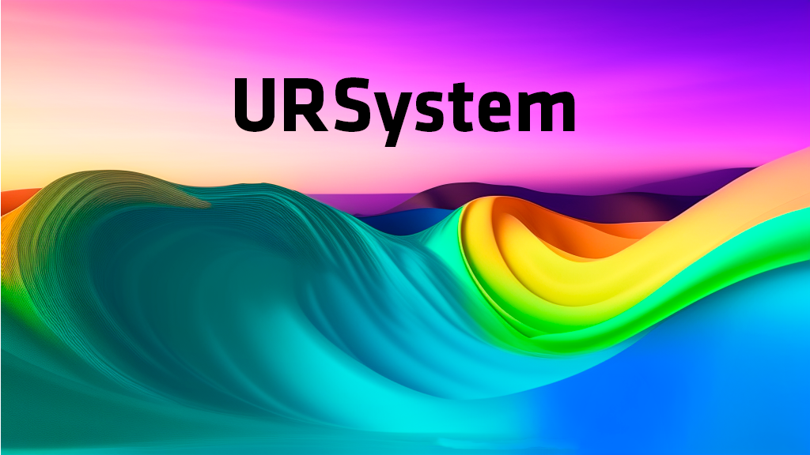
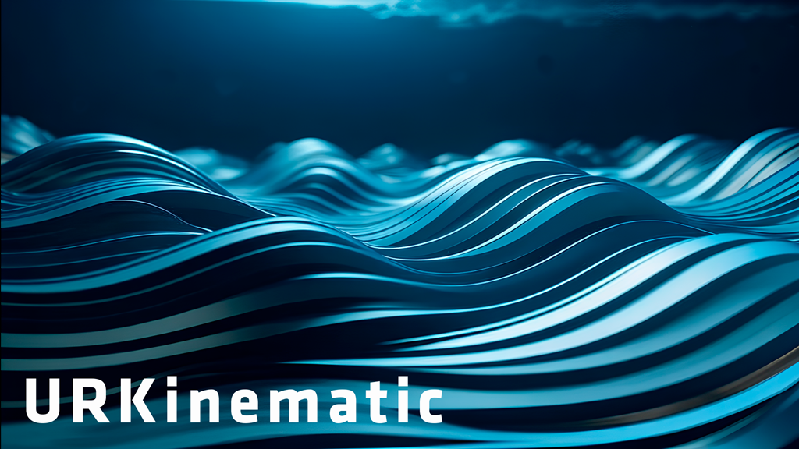

<p align="center"></img></p>

Система разработки и автоматизации промышленных роботов. Система разработана с целью стандартизации и ускорения работы с промышленными роботами. Благодаря использованию концепции IOT открываеться возможность удалённого управления и администрирования системой. Система логирования и безопасности обеспечивает высокую надёжность и лёгкую читаемость, что позволяет определять различные критические ситуации и вовремя на них реагировать. Название происходит от слова United потому что система содержит всебе различные аспекты управления и программирования от роботов таких производителей как Fanuc и Kuka.

## API
[Документация по API](doc/API.md)

## Модули
Система состоит из таких модулей:
|          Название         |       Описание       |
|---------------------------|----------------------|
|`URSecyrity`| Обеспечивает безопасность различными методами, более подробно читать [здесь](#URSec).|
|`URLogs` | Обеспечивает возможность логирования любой информации: о попытках несанкционированного получения доступа к системе, обращения к функционалу не соответствующего уровня доступа, информация о происходящих действиях и другое. Подробнее [здесь](#URLogs).|
| `URAccounts` | Позволяет определять уровень доступа к определённым фунциям сервера, а также управлять аккаунтами от имени супер администратора|
| `URLanguage`| Модуль не входящий в состав проекта URSystem. Создан для упращения работы с системой, содержит в себе модули для расчёта траекторий и много другого функционала. Подробнее [здесь](https://github.com/MrBrain-YT/URLanguage).|
| `URPublic` | Позволяет загружать модули, для работы со своим оборудованием, а также для добавления своих методов API|
| `URKinematic` | Позволяет загружать скрипты расчёта кинематики, для преобразования углов в позиции и обратно| 

- <p align="center" id="URSec"></img></p>


    Модуль обепечивает защиту от несанкционированого проникновения в систему различными способами: 
    - Проверка сертификата безопасности (По стандарту сертификат уже присутствует и активен для предотвращения атаки `человек по середине`) (Функцию можно отключить).
    - Проверка на секретный код доступа к серверу с данными о пользователе (по стандарту сервер с данными о пользователях это и есть сервер системы управления роботами. Они совмещены). По данному коду происходит проверка, нужно ли вообще этот запрос обрабатывать.
    - Проверка имени пользователя и пароля (Если всё верно то пользователь получит токен который можно использовать для запросов).
    - Проверка секретного кода робота (Проверка происходит при всех запросах касающихся управлением роботов) код настраиваеться для каждого робота отдельно (можно применять для разделения роботов между операторами).
    - Проверка програмного токена робота (Если робот запущен с автоматической программой, то любой запрос касающийся его управлением должен содержать этот токен. Этим токеном владеет только программа которая была с ним запущена, во внешнюю среду он не попадает (Сейчас его можно получить запросив список всего оборудования от имени администратора, но эта возможность будет удалена)).

    ## Класс определяющий доступ к методам API
    `Access` класс находящийся в модуле `API.access_manager`. Класс позволяет настраивать доступ к методам API. Список настраиваемых параметров:
    - `check_robot` - обрабатывает метод в случае обращения к нему пользователем с ролью робота.
    - `check_robot_or_user` - обрабатывает метод в случае обращения к нему пользователем с ролью робота (`если не нужно проверять данные робота, только роль`) или пользователя. Роли пользователя можно настраивать 
        ```python
        @check_robot_or_user(user_role="user")
        def test():
        ```
    - `check_user` - обрабатывает метод в случае обращения к нему пользователем с ролью (`user`, `administrator`, `SuperAdmin`). Роли пользователя можно настраивать 

        ```python
        @check_user(user_role="user", loger_module="URAccounts")
        def test():
        ```
    - `check_user_and_robot_data` - обрабатывает метод в случае обращения к нему пользователем с ролью пользователя если нужно проверять данные робота. Роли пользователя можно настраивать
        ```python
        @check_user_and_robot_data(user_role="user", loger_module="URAccounts")
        def test():
        ```
    - `check_robot_user` - обрабатывает метод в случае обращения к нему пользователем с ролью робота (`если нужно проверять данные робота, не только роль`) или пользователя. Роли пользователя можно настраивать 
        ```python
        @check_robot_user(user_role="user", loger_module="URSystem")
        def test():
        ```
    - `check_robot_user_prog_token` - обрабатывает метод в случае обращения к нему пользователем с ролью робота или поользователя (`user`, `administrator`, `SuperAdmin`). Если обращение происходит с ролью робота то проверяеться секретный код робота, его програмный токен и роль робота, если с ролью пользователя то проверяеться секретный код робота и роль пользователя. Роли пользователя можно настраивать 
        ```python
        @check_robot_user_prog_token(user_role="user")
        def test():
        ```
    - `check_robot_user_prog` - обрабатывает метод в случае обращения к нему с ролью поользователя (`user`, `administrator`, `SuperAdmin`) и верными данными робота. 
    Роли пользователя можно настраивать 
        ```python
        @check_robot_user_prog(user_role="user", loger_module="URSystem")
        def test():
        ```

# 
- <p align="center" id="URLogs"></img></p>

    Модуль для логирования всех действий происходящих на сервере. Разделяються на логи сервера и роботов отдельно. Пример логируемых ситуаций:
    - Изменение конфигурации оборудования (добавление робота, инструмента или иного оборудования).
    - Попытка выполнить запрос с некоректным или не допустимым уровнем доступа (неверный токен пользователя, секретный код робота или сервера с данными пользователей и другое).
    - Изменение параметров робота (позиции, скорости) записываються в логи конкретного робота
    - Состояние запускаемых модулей и подмодулей (подмодуль - пользовательский модуль)
    
    При передаче параметра `timestamp` вы указываете unix-time время. Для получения лога вам надо предоставить такое время которое входит в день, лог котороого вы хотите получить. Например число `1745249304` это `18:28 21.04.2025` соответственно вы получите все сообщения за `21.04.2025`.
    ## Типы логируемых сообщений
    - `DEBUG` - информационное сообщение выводимое пользователем.
    - `INFO` - информационное сообщение выводимое системой управления.
    - `WARNING` - сообщение предупреждающее о чём либо.
    - `ERROR` - сообщение об ошибке

    ### Пример сообщения
    ```log
    [18:16:8] [INFO] [URSecurity] Succes load SSL
       time    type     module        Message
    ```

# 
- <p align="center"></img></p>

    Модуль управляющий аккаунтами. Для работы с модулем нужно знать следующие факты:
    ## Общая информация
    Аккаунтов может быть бесконечное количество (всё упираеться в количество памяти на хосте). Если мы берём в учёт количество роботов то нужно учитывать общюю мощность сервера, так как на сервер приходит очень много запросов для получения свежих данных `(эта проблема возможно будет решена при добавлении новых протоколов связи)`.
    ## Виды ролей
    - `System` - роль выполняющая системные функции (вызов программ автоматики). Аккаунт с такой ролью может быть толко один в системе. Токен меняеться после каждого запроса.
    - `SuperAdmin` - пользователь с высшими правами, ему разрешено работать с аккаунтами пользователей, экспортировать и импортировать конфигурации оборудования и т.д.
     - `administrator` - пользователь с возможностью управлять параметрами роботов и прочего оборудования, читать логи и т.д. (Данная роль подходит программистам и наладчикам).
    - `user` - пользователь с возможностью управлять роботами и другим оборудованием. (Данная роль подходит операторам).
    - `robot` - аккаунты с данной ролью создаються для роботов и используються для программ автоматики. (До сегоднешнего дня остаёться проблема возможности управления одним роботом через другого).

# 

- <p align="center"></img></p>
    Модуль для загрузки своих подмодулей для расширения API или для работы с этими подмодулями в режиме автоматики.
    ## Примеры
    
    - `Написание метода для API`

        ```python
        from utils.public_loader.loader import app
        from flask import jsonify

        @app.route('/my-module/test')
        def test():
            return jsonify({"text": "Hello World"}, status=200, mimetype='application/json')

        def return_app():
            return app
        ```
        `return_app` - функция ожидаемая при импорте пользовательского модуля. Выполняет функцию возврата изменённого `app` параметра.

    - `Написание подмодуля для использования в автоматическом режиме`

        ```python
        def test(i:int):
            return 5 + i
        ```
        Пример вызова функции `test` из публичного API модуля `test.py`
        ```python
        from utils.public_loader.loader import app
        from flask import jsonify

        from public.test import test

        @app.route('/my-module/test2')
        def test2():
            return jsonify({"text": "Hello World"}, status=200, mimetype='application/json')

        def return_app():
            return app
        ```
        Также функцию можо использовать в программе автоматики (путь импорта не изменится). 

# 

- <p align="center"></img></p>
    Модуль для работы с файлами кинематики. Позволяет добавлять файлы обработки кинематики и привязывать к роботам.

    Файл с модулем кинематики должен быть назван `kin.py`. Модуль являеться связующим файлом для расчётных файлов. Расчётные файлы могут быть написаны на разных языках. В модуле kin.py должены быть методы `Forward` и `Inverse`.
    Они вызываються во время выполнения API методов требующих использование кинематики. Если на робота не привязана ни одна кинематика он не быдет выполнять некоторые API методы, или будет выполнять их частично.

    ## Forward
    ```python
    def Forward(J1, J2, J3, J4):
    ```
    Параметры функции принимают значения углов. В данном примере показаны параметры для 4-осевго робота.

    ## Forward
    ```python
    def Inverse(x ,y ,z):
    ```
    Параметры функции принимают значения позиции. (`Сейчас позиции имеют только координаты, позже будут добавлены параметры a, b, c для указания ориентации системы координат`)
