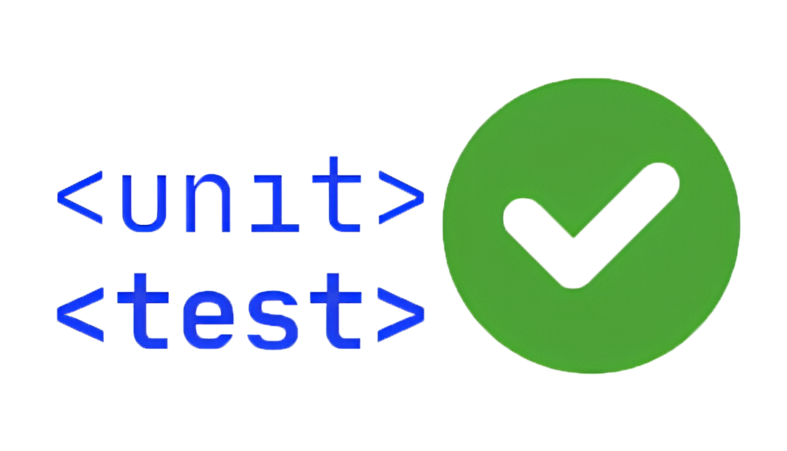

</img>

# Авто тесты

Тесты работающие на основе `pytest` проверяют функционал работы всей системы.

### Всё что нужно знать

- Написаны в определённом порядке, поэтому при перестановке тестов могут возникать ошибки, это связанно с инициализацией некоторых элементов (`базы`, `инструмента` или `фрейма`) в одном тесте, проверкой в другом и удалением данного элемента в третьем.

- Все данные в тестах беруться из конфинурационного файла `config.py`

- Для проверки тестов работающих с кинематикой, просьба установить все пакеты из `requirements_kinematic.txt`

- Созданы для облегчения проверки кода от сторонних разработчиков (`если вы предлагаете сливать ветку, все тесты должны быть обязательно пройдены`)

- В данный момент тесты и основной сервер работают как с разными базами аккаунтов так и конфигурацией оборудования, поэтому их можно запускать вместе, но это не рекомендуеться при работе сервера на производстве